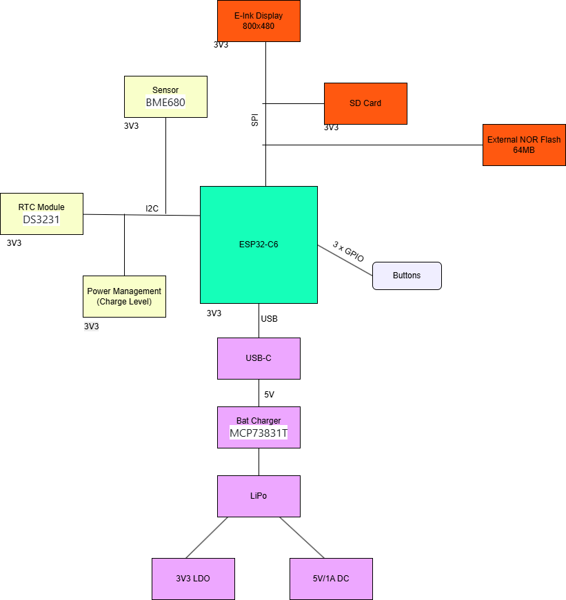
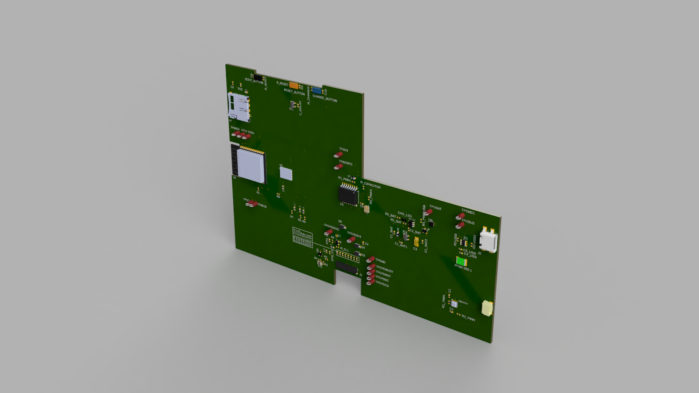
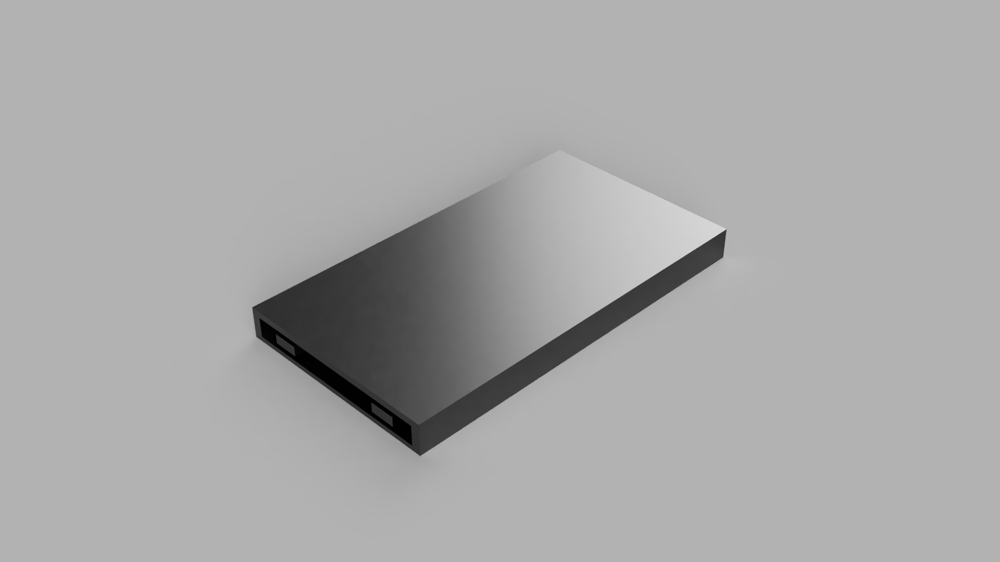
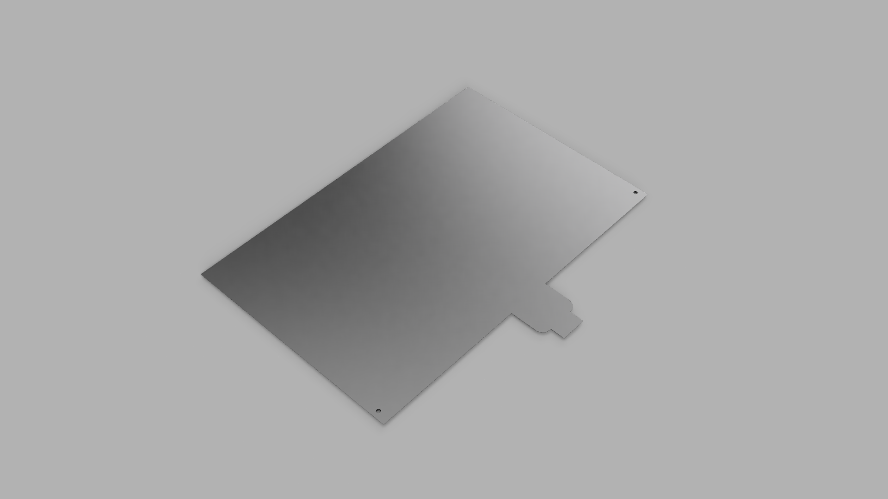
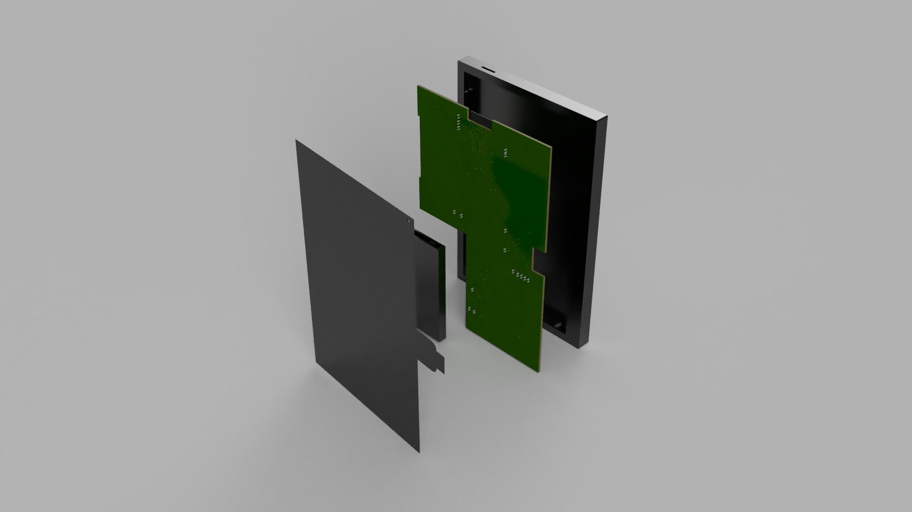
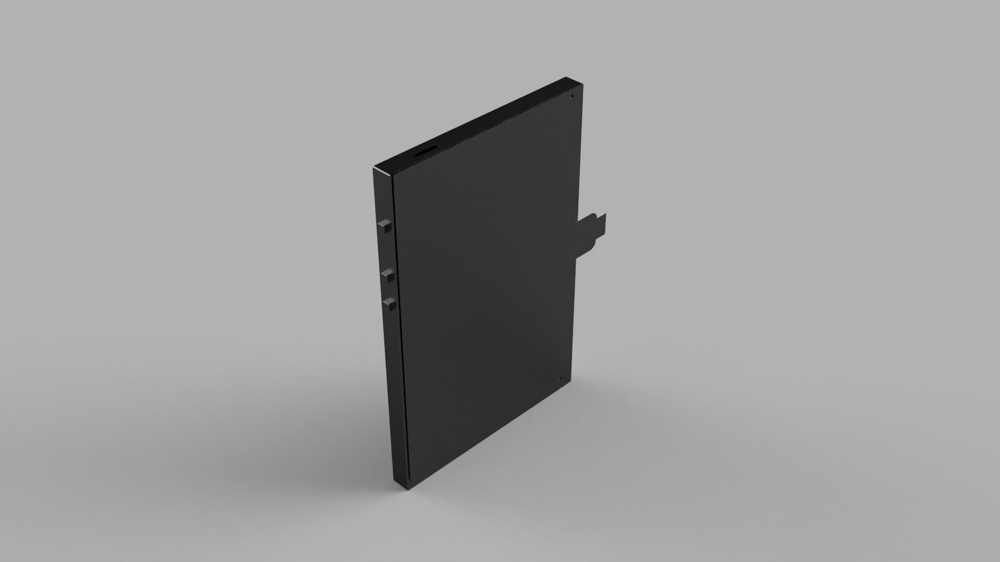
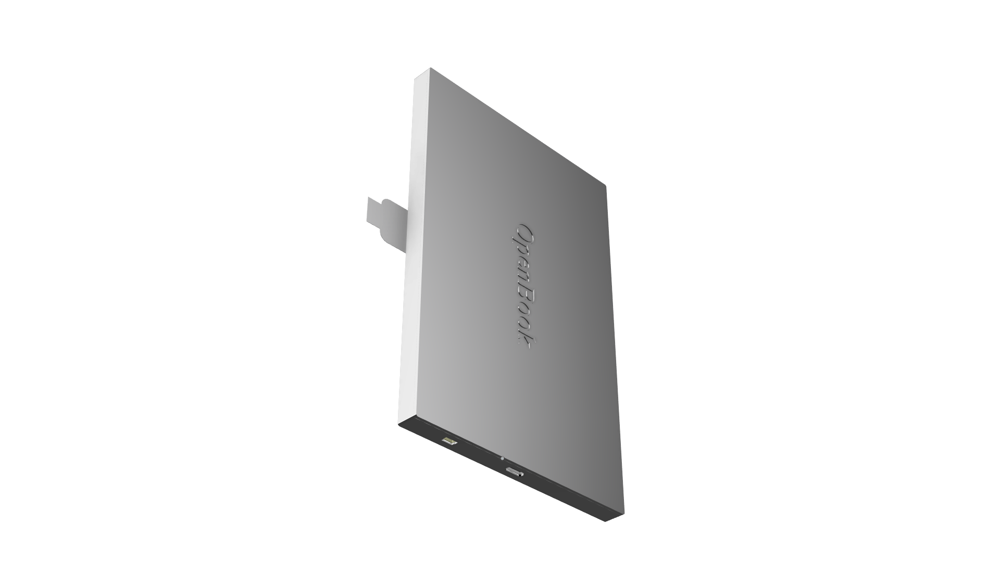

# OpenBook-reader

## Overview

OpenBook is an open-source e-book reader designed to be affordable and customizable. It is built around the ESP32-C6 microcontroller and integrates an E-Ink display, a Li-Po battery, and a microSD slot for extended storage. The device targets a wide range of users, from hobbyists to developers, who want to create their own e-book reader or modify existing designs.

## Table of Contents

1. [Features](#features)

2. [Data](#data)

3. [Block Diagram](#block-diagram)

4. [Hardware Functionality](#hardware-functionality)

5. [Hardware Components & Datasheets](#hardware-components--datasheets)

6. [Implementation](#implementation)

7. [Design Decisions and Trade-offs](#design-decisions-and-trade-offs)

8. [3D Visualizations](#3d-visualizations)
   
9. [Testing and Debugging](#testing-and-debugging)

10. [Suggestions](#suggestions)

## Features

- **Microcontroller**: ESP32-C6 with Wi-Fi and Bluetooth capabilities

- **Display**: 7.5" E-Ink display with a resolution of  800x480 pixels

- **Storage**: MicroSD card slot for additional storage

- **Battery**: Rechargeable Li-Po battery with a capacity of 2500mAh

- **Connectivity**: Wi-Fi 6, Bluetooth 5.0, and USB-C for charging and data transfer

- **Sensors**: Integrated environmental sensor (BME680) for temperature, humidity, pressure, and gas measurements

- **Real-Time Clock**: DS3231 for accurate timekeeping

- **User Interface**: 3 tactile buttons for navigation and control

## Data

Dimension: 175mm x 114mm x 10mm

Weight: 250g
Supported file formats: EPUB, PDF, TXT, FB2.

Operating system: FreeRTOS

Charging: 5V/1A via USB-C

## Block Diagram

## Hardware Functionality

### Microcontroller:

The ESP32-C6 is the main processing unit, responsible for handling all system operations, including e-paper display updates, wireless communication, and power management. It features:

- RISC-V architecture 32-bit core

- 2.4 GHz Wi-Fi and Bluetooth 5.0 connectivity

-  160 MHz clock speed with 4 stage pipeline

- L1 chache 16KB

- ROM 320KB

- SRAM 512KB(HP) + 16KB (LP)

- 30 GPIO pins

Power consumption: 160uA in deep sleep mode, 10mA in active mode

### Display:

- Type: E-Ink (E-Paper) display

- Size: 7.5 inches

- Resolution:  800x480 pixels

- Communication: SPI interface

- Power consumption: ~1.2mW in active mode, ~0.1mW in standby mode

Connection to the ESP32-C6 and other modules:

> IO7 -> MOSI(14)

> IO6 -> SCK(13)

> IO10 -> EPD_CS(12)

> IO5 -> EPD_DC(11)

> IO23 -> EPD_RST(10)

> IO3 -> EPD_BUSY(9)

Connection to power:

> EPD_3V3 -> 3.3V

### MicroSD Card

- Type: MicroSD card

- Capacity: Up to 32GB (FAT32 format)

- Communication: SPI interface

- Power consumption: ~50mA during read/write operations, ~10uA in standby mode

Connection to the ESP32-C6 and other modules:

> IO7 -> MOSI(CMD)

> IO6 -> SCK(CLK)

> IO4 -> SS_SD(CD/DAT3)

> IO2 -> MISO(DAT0)

### Battery and Power Management

- Type: Li-Po battery

- Capacity: 2500mAh

- Voltage: 3.7V nominal, 4.2V max

- Voltage regulator: MCP73831T for charging and power management

- Charging: 5V/1A via USB-C

- Power consumption: ~10mA during active mode, less than 50uA in deep sleep mode

Connection to the ESP32-C6 and other modules:

> CELL -> BAT

> IO21 -> SDA(SDA)

> IO22 -> SCL(SCL)

### Environmental Sensor

- Type: BME680

- Measurement: Temperature, humidity, pressure, and gas

- Communication: I2C interface

- Power consumption: ~3.6mA during measurement, ~0.1uA in sleep mode

Connection to the ESP32-C6 and other modules:

> IO21 -> SDA(SDI)

> IO22 -> SCL(SCK)

> IO19 -> I2C_PW(VDDIO)

### Real-Time Clock

- Type: DS3231

- Function: Accurate timekeeping

- Communication: I2C interface

- Power consumption: ~1.5uA in battery backup mode, ~0.1uA in sleep mode

Connection to the ESP32-C6 and other modules:

> IO21 -> SDA(15)

> IO22 -> SCL(16)

> IO18 -> RTC_RST(RST)

> IO1 -> 32KHz(32KHz)

> IO0 -> INT_RTC(SQW/INT)

### External Nor Flash

- Type: SPI Flash

- Capacity: 64MB

- Communication: SPI interface

- Power consumption: ~10mA during read/write operations, ~0.1uA in standby mode

Connection to the ESP32-C6 and other modules:

> IO11 -> EPD_CS(CS)

> IO6 -> SCK(CLK)

> IO2 -> MISO(DO/IO1)

> IO7 -> MOSI(DI/IO0)

### USB-C Connector

- Type: USB-C connector

- Function: Charging and data transfer

- Power consumption: ~5V/1A during charging, ~0.1uA in standby mode

- Protection: PFMF varistor for ESD protection

- Diode: Schottky barrier rectifier diode for reverse polarity protection

### Buttons

- Type: Tactile push buttons

- Number: 3

- Function: User input for navigation and control

Connection to the ESP32-C6 and other modules:

> EN -> RESET

> IO9 -> IO/BOOT

> IO15 -> IO/CHANGE

### Calculations

| Component | Current Draw (mA) | Voltage (V) | Power (mW) |
|-----------|-------------------|-------------|------------|
| ESP32-C6  | 10 | 3.3         | 33         |
| E-Ink Display | 1.2 | 3.3         | 3.96       |
| MicroSD Card | 50 | 3.3         | 165        |
| BME680 | 3.6 | 3.3         | 11.88      |
| DS3231 | 0.015 | 3.3         | 0.0495     |
| MCP73831T | 10 | 3.3         | 33         |
| USB-C Connector | 5 | 5         | 25         |
| External Flash | 10 | 3.3         | 33         |

Total Power Consumption: 304.3 mW
Total Current Draw: 89.8 mA

## Hardware Components & Datasheets

| Name | Description | Num | Datasheet | Price |
|------|-------------|-----|-----------|-------|
| Micro-SD | Micro-Sd | 1 | https://www.attend.com.tw/data/download/file/112A-TAAR-R03_Spec.pdf | https://www.digikey.com/en/products/detail/attend-technology/112A-TAAR-R03/17633923 |
| Inductor | 68uH | 1 | https://www.we-online.com/components/products/datasheet/784373170680.pdf | https://eu.mouser.com/ProductDetail/Wurth-Elektronik/784373170680?qs=sGAEpiMZZMv126LJFLh8yzGkpireax1GgDeN9GF1EUQ%3D |
| Led | No description | 1 | https://www.bridgelux.com/sites/default/files/resource_media/DS51_Rev%20F%20Bridgelux%20SMD%203030%20Data%20sheet.pdf | https://www.digikey.com/en/products/detail/bridgelux/BXEM-27E0000-0-000/6618599 |
| Voltage Detector | With Adjustable Delay Time | 1 | https://www.rohm.com/datasheet?p=BD5229G&dist=Digi-key&media=referral&source=digi-key.com&campaign=Digi-key | https://www.digikey.com/en/products/detail/rohm-semiconductor/BD5229G-TR/658502?s=N4IgTCBcDaIEIBECsYwE4DiBaAKgJRAF0BfIA |
| Buttons | No description | 3 | https://configured-product-images.s3.amazonaws.com/Datasheets/TL3315.pdf | https://www.digikey.com/en/products/detail/e-switch/TL3315NF250Q/1870396 |
| Super Capacitor | 0.011F 3.3V | 1 | https://mm.digikey.com/Volume0/opasdata/d220001/medias/docus/6537/rev05-CPHCPM.pdf | https://www.digikey.com/en/products/detail/seiko-instruments/cph3225a/8692444 |
| Real Time Clock | Serial 16-Pin SOIC | 1 | https://www.analog.com/media/en/technical-documentation/data-sheets/DS3231.pdf | https://www.digikey.com/en/products/detail/analog-devices-inc-maxim-integrated/DS3231SN/1197576 |
| Capacitor | 8 x 100uF + 6 x 4.7 uF + 1uF x 11 + 1 x 10uF -> Check this capacitor series(look at capacitance code to buy from the specs)| 26 | https://eu.mouser.com/datasheet/2/40/cx5r_KGM-3223198.pdf | https://eu.mouser.com/ProductDetail/KYOCERA-AVX/0402YD104MAT2A?qs=4PckX6MNpMErOINbbZj3Cw%3D%3D&srsltid=AfmBOorRllqAGFDVGSlUxRe1HCu5DEMiSSNplU-KeE2woDnCuT1J4_ia |
| ESP32-C6-WROOM-1-N8 | Microcontroller of choice | 1 | https://www.espressif.com/sites/default/files/documentation/esp32-c6-wroom-1_wroom-1u_datasheet_en.pdf | https://www.digikey.com/en/products/detail/espressif-systems/ESP32-C6-WROOM-1-N8/17728866?utm_source=snapeda&utm_campaign=buynow&utm_medium=aggregator |
| Varsistor | Used in the USB Connector zone | 1 | https://ro.mouser.com/datasheet/2/358/typ_PFMF-1275918.pdf | https://ro.mouser.com/ProductDetail/Schurter/PFMF.050.2?qs=1auRipcfynCums5v1iucSA%3D%3D |
| Diode | Schottky Barrier Rectifier Diode | 2 | https://datasheets.kyocera-avx.com/schottky.pdf | https://www.digikey.com/en/products/detail/kyocera-avx/sd0805s020s1r0/3749517 |
| Integrated Environmental Unit | Sensor | 1 | https://www.bosch-sensortec.com/media/boschsensortec/downloads/datasheets/bst-bme680-ds001.pdf | https://www.digikey.com/en/products/detail/bosch-sensortec/bme680/7401317 |
| Resistor | Search on DigiKey 0402 smd resistor x (size). The link contains both the site to but from and the datasheet in the order from 'Num' coloumn. |5K1 x 1 + 100K x 1 + 10K x 16 + 0.47 x 1 + 2K x 1 + 200 x 1 + 15 x 1 | [https://www.yageo.com/upload/media/product/products/datasheet/rchip/PYu-RC_Group_51_RoHS_L_12.pdf](https://www.digikey.com/en/products/detail/yageo/RC0402FR-075K1L/726624) - https://www.digikey.com/en/products/detail/yageo/RC0402JR-07100KL/726416 - https://www.digikey.com/en/products/detail/yageo/RC0402JR-0710KL/726418 - https://www.digikey.com/en/products/detail/cts-resistor-products/73L1R47J/1543472 - https://www.digikey.com/en/products/detail/panasonic-electronic-components/ERJ-2RKF2001X/192194 - https://www.digikey.com/en/products/detail/panasonic-electronic-components/ERJ-2RKF2000X/192215 - https://www.digikey.com/en/products/detail/panasonic-electronic-components/ERJ-2RKF15R0X/192142 | Check the 'Datasheet' section |
| P-channel MOSFETs | DMG2305UX-7 | 2 | https://www.diodes.com/assets/Datasheets/DMG2305UX.pdf | https://www.digikey.com/en/products/detail/diodes-incorporated/DMG2305UX-7/4340667 | 
| Li-Ion, Li-Pol Controller | MCP73831T | 1 | https://ww1.microchip.com/downloads/en/DeviceDoc/MCP73831-Family-Data-Sheet-DS20001984H.pdf | https://www.digikey.com/en/products/detail/microchip-technology/MCP73831T-2ACI-OT/964301 |
| Hirose Connector | 24 Position FFC, FPC Connector Contacts, Top and Bottom 0.020" (0.50mm) Surface Mount, Right Angle | 1 | https://ro.mouser.com/datasheet/2/185/FH34SRJ_24S_0_5SH_99__CL0580_1255_6_99_2DDrawing_0-1615044.pdf | https://ro.mouser.com/ProductDetail/Hirose-Connector/FH34SRJ-24S-0.5SH99?qs=vcbW%252B4%252BSTIpKBl5ap9J8Fw%3D%3D |
| Battery Monitor IC | 3µA 1-Cell/2-Cell Fuel Gauge with ModelGauge | 1 | https://datasheets.maximintegrated.com/en/ds/MAX17048-MAX17049.pdf | https://www.digikey.com/en/products/detail/analog-devices-inc-maxim-integrated/MAX17048G-T10/3758921?utm_source=snapeda&utm_campaign=buynow&utm_medium=aggregator |
| Diode | DIODE, SCHOTTKY, 0.5A, 30V, SOD-123 | 3 | https://ro.mouser.com/datasheet/2/258/MBR0520_MBR0580_SOD123_-2492194.pdf | https://ro.mouser.com/ProductDetail/Micro-Commercial-Components-MCC/MBR0530-TP?qs=KFo7JewZbUECRHkxGanrdg%3D%3D&utm_id=6470900573&utm_source=google&utm_medium=cpc&utm_marketing_tactic=emeacorp&gad_source=1&gclid=CjwKCAjwwLO_BhB2EiwAx2e-3ydGTTX86bQDTTakfn6ATmKxw6Z5gldNGNQk4bDz2SK5HmB7sD0ZQxoCdvQQAvD_BwE&_gl=1*1n24ce1*_ga*MTM0NDU1MzYwMi4xNzQzMjYxMTcy*_ga_15W4STQT4T*MTc0MzU5MDMwOC41LjEuMTc0MzU5MjU2NS4xOC4wLjA. |
| Diode | ESD Suppressor Diode Polymer Bi-Dir 24V 150Vc 2-Pin Case 0603(1608Metric) T/R | 6 | https://www.littelfuse.com/assetdocs/pulseguard-esd-suppressors-pgb1-datasheet?assetguid=8a337998-d54d-466b-be4e-dc5bcd1f9321 | https://www.digikey.com/en/products/detail/littelfuse-inc/PGB1010603MR/715755?utm_source=snapeda&utm_campaign=buynow&utm_medium=aggregator |
| Qwiic Connector | SparkFun I2C Standard Qwiic Connector | 1 | Check https://www.sparkfun.com/qwiic | https://www.digikey.com/en/products/detail/onion-corporation/om-e-qwiic/9922970 |
| Capacitor | Polarized, 0.5pF ~ 100uF | 1 | https://ro.mouser.com/datasheet/2/281/1/GCQ1555C1HR50WB01_01A-3146956.pdf | https://ro.mouser.com/ProductDetail/Murata-Electronics/GCQ1555C1HR50WB01D?qs=0lQeLiL1qybSG%2FOlONlvIA%3D%3D |
| Connector USB | CONN USB 2.0 TYPE-C R/A SMT | 1 | https://eu.mouser.com/ProductDetail/GCT/USB4110-GF-A?qs=KUoIvG%2F9IlYiZvIXQjyJeA%3D%3D&utm_id=6470900573&utm_source=google&utm_medium=cpc&utm_marketing_tactic=emeacorp&gad_source=1&gclid=CjwKCAjwwLO_BhB2EiwAx2e-37JzTMkPOyYe_IgHkPGbT94lZUm900GBIAmoPtrMJZJCTbY6hQYkwBoChsQQAvD_BwE | https://gct.co/files/drawings/usb4110.pdf |
| N-channel MOSFETs | Mosfet N-Channel 30 V 1.4A (Tc) 400mW (Ta), 500mW (Tc) Surface Mount SC-70-3 (SI1308EDL-T1-GE3)| 1 | https://www.vishay.com/docs/63399/si1308edl.pdf | https://www.digikey.com/en/products/detail/vishay-siliconix/si1308edl-t1-ge3/4876435 |
| Solder Jumper | We can use 0 ohms resistor | 1 | https://industrial.panasonic.com/ww/products/pt/general-purpose-chip-resistors/models/ERJ2GE0R00X | https://www.digikey.com/en/products/detail/panasonic-electronic-components/ERJ-2GE0R00X/146727 |
| Test Pad | Testing points for the PCB (Adafruit). | 17 | https://analytics.supplyframe.com/trackingservlet/track/?r=0x34EY99PS_gIu2qWuzU9_U842M9-un2szqNoXX0OQ9lqbiEKGN3BJ73jgvlrgiXR89Peb0evqc4GXoUXllBhu1MMSvPYuTjdNvrqssrdYelKlOnXRLLdDb62WVGcgff9ScDqkaNl77wLfnOOEQKj2STWkPX13L-FNZ3oWIMFUHCC5-qDG-7Yig6Avs38Cl7gJvFvhhIZBQgwOTPSvwankeiqCZiPIu4pf1a70cDpS5iXBHs4MnmfZND2GG-sF6aJg5UUnsB5VhTJSE6wk45p-6HRTMw22O4bszSnP2Q-ZnkBbKsUJKjNCqwjgBsJDq1_QscdqTO6PxRf527DX_uye2RbWidMqOlR-Vbcwp2OFH8GWfRIZFBGLsZvpqmkT4i-YX6Nptn2BWY2qtOQUnzCPdCvB7YMhgJaZgpVomGW3xiBrXHrx7fYI1m3zFYuPc18lUM4dLxlLjbOFrCL0NYDVpEveG92dFwHfnYbXQgvjrXr2rAOwFVNwEcAFSYk5ktrRa9hExtgpErVY2QODMhmvQzib95lr7oG9joYEr_b8joW8nw_gi1w2cyDxUshEAF | https://componentsearchengine.com/prices/3825?manufacturer=Adafruit |

## Implementation

### Initial Setup and Tool Selection

- Choose your PCB design software(Fusion360)

- Prepare the mechanical dimensions and casing files provided

### Create the Schematic

- Add the ESP32-C6 microcontroller, power components, display interfaces, buttons, and other required components

- Ensure the pin configuration for the ESP32-C6 matches the required hardware interfaces (e.g., SPI for the display, I2C for sensors).

- Implement decoupling capacitors near the power pins

- Electrical Design Validation (EVT)

### PCB Layout Design

- Place major components like the ESP32, display, and battery connectors according to the provided layout recommendations

- Route the traces carefully, avoiding sharp angles and placing vias in non-critical signal paths

- Design Rule Check(DRC)

### Mechanical Design Integration

- Create 3D models for case, battery and display for integration

- Verify that all components fit within the casing and that connectors like USB and SD card slots align with physical cutouts

## Design Decisions and Trade-offs

- Decoupling capacitors(100nF) should be placed close to the power pins of major components.

- Power traces width: 0.3mm

- Power traces were routed without vias to ensure low impedance and reliable power delivery.

- Signal traces width: 0.15mm

- No routing under ESP antenna.

- 2 layers PCB with 2 ground planes.

- All components on TOP Layer.

- Test pads were placed close to the relevant signals to facilitate easier probing and debugging.

- PCB cut near ESP32-C6 antenna for better signal, with a keep-out zone to reduce interference.

- The ESP32-C6 features multiple low-power modes (including deep sleep and light sleep) and efficient power domain management.

- Via stitching under the ESP32-C6 is beneficial for improving thermal dissipation and electromagnetic interference (EMI) performance.

- The PCB layout follows the reference design shown in Images/layout_reference.pdf.

- All PCB traces are routed to avoid 90-degree angles to ensure signal integrity and reduce the risk of electromagnetic interference (EMI).

- The 3D connection model for the display has been designed to provide a realistic representation of the **Display**; however, the connection model it's not flexible(used just for accurate display representation).

- The models for the battery and display are included to mimic their real-world sizes for visualization purposes. They do not reflect the actual hardware functionality or internal components.

- Integrating ESD protection helps safeguard sensitive components—like the ESP32-C6 and display driver—from electrostatic discharge events

## 3D Visualizations

### PCB

### Battery

### Display

### Full Product

## Testing and Debugging

The OpenBook PCB has test pads for each major communication and power line.

1. TPRX - RX signal
2. TPTX - TX signal
3. TPVBAT - Battery voltage
4. 2 x TPGND - Ground
5. TP3V3 - 3.3V power
6. TPEPD_3V3 - EPD 3.3V power
7. TPMISO - MISO signal
8. TPMOSI - MOSI signal
9. TPSCK - SCK signal
10. TPEPDBUSY - EPD BUSY signal
11. TPEPDCS - EPD CS signal
12. TPEPDDC - EPD DC signal
13. TPEPDRST - EPD RST signal
14. TPEPD3V3C - EPD 3.3V power
15. TPVBUS - VBUS voltage
16. TPINTRTC - RTC interrupt signal

## Suggestions

- Operating system: FreeRTOS

- Programming language: C/C++

- IDE: PlatformIO or Arduino IDE

- Libraries: ESP-IDF, EPD library, SD card library, BME680 library, DS3231 library

- Communication protocols: SPI, I2C, UART

- Power management: Use deep sleep mode to save power when not in use

- User interface: Use a simple menu system for navigation and control

- File management: Implement a file system for easy access to e-books on the microSD card

- E-book reader software: Use an existing open-source e-book reader software or develop a custom solution

